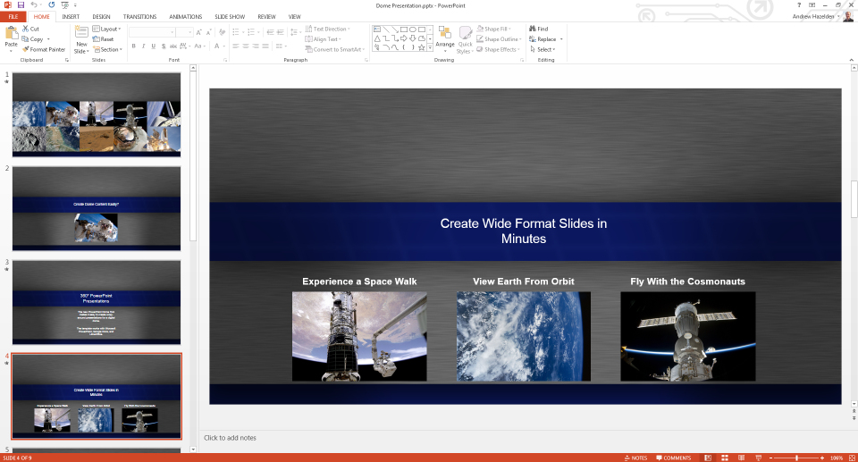
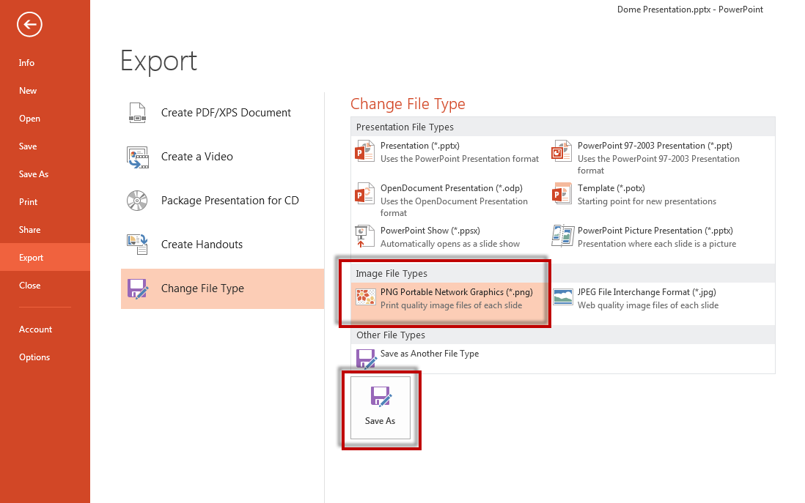
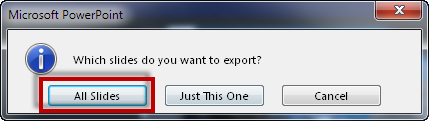
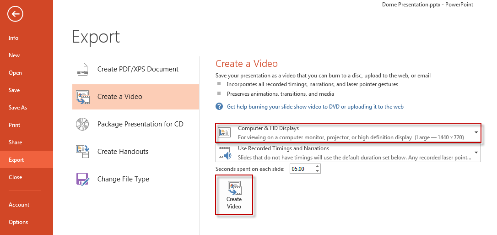
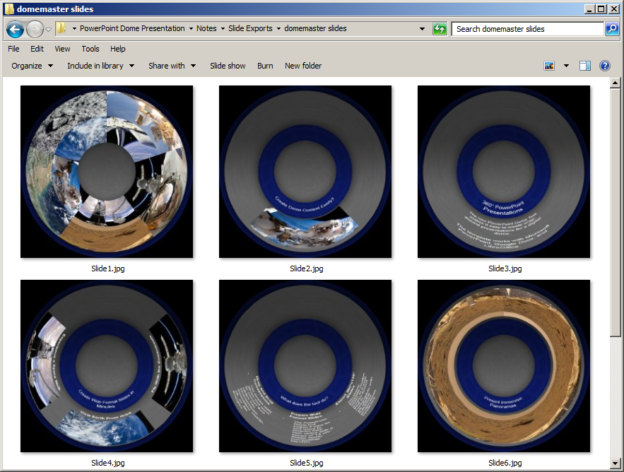
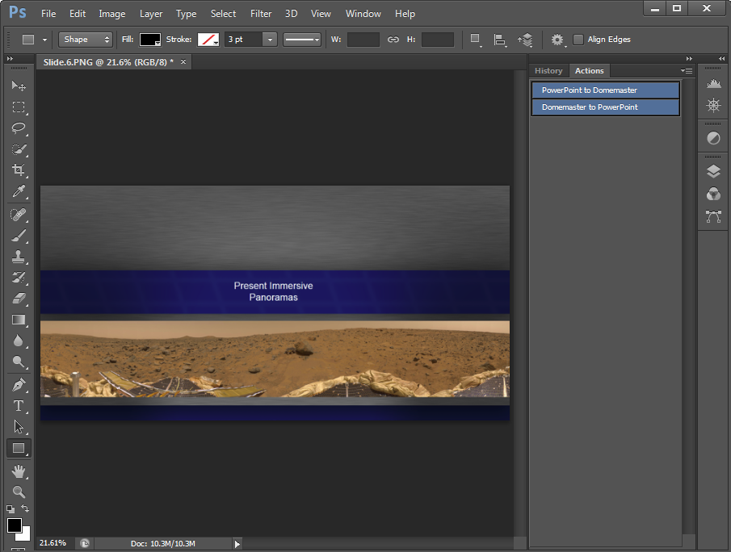

#PowerPoint Dome Template
**Version 1.0** - Released June 10, 2013  
by Andrew Hazelden

About the Software
-----------------
The PowerPoint Dome Template provides a simple and effective way to create fulldome formatted presentations. The PowerPoint template comes with 14 "dome optimized" slide layouts. You can use the template file with Microsoft PowerPoint, Google Docs, and LibreOffice.

The PowerPoint template file is a 2:1 aspect ratio document that covers a 360 degree x 90 degree field of view. If your dome projection system allows you to display panoramic imagery directly you can use the Powerpoint generated .PNG or .JPG slides without any extra image processing. 

#Exporting PowerPoint Slides

You can use PowerPoint to export your presentation to a series of JPG or PNG slides.

##Step 1. Export the Slides
Start by selecting the Export menu item.

##Step 2. Choose a File Type
Click on the "Change File Type" menu item and select either the PNG or JPEG option.

##Step 3. Save the Slides to a Folder
Click the Save As button to export your slides. PowerPoint will ask you to select an output directory for the images.

##Step 4. Choose What Slides to Export
To export all of the slides in your presentation choose the "All Slides" button during the save process.

-----------------

#Maximizing the Export Resolution
It is possible to boost the maximum PowerPoint slide export resolution using the Windows Registry Editor. You can read the guide on the [Microsoft support site: How to change the resolution of a slide that you export as a picture in PowerPoint](http://support.microsoft.com/kb/827745?wa=wsignin1.0).

##PowerPoint Video Export 
Microsoft's PowerPoint 2013 software allows you to export your presentation to a 1440x720 resolution MPEG4 video file. The PowerPoint video export feature can export your PowerPoint shows to a video file with custom slide timing, animated transitions, and audio narrations.

To export your PowerPoint dome presentation to a video file, open the Export screen and choose "Create a Video". Selecting the "Computer & HD Displays" option will enable the 1440x720p video format.

-----------------

#Photoshop Action Installation

The PowerPoint Dome Template comes with a bonus Photoshop action and droplet program for converting your PowerPoint exported .PNG or .JPG slides into angular fisheye formatted "domemaster" images.

#Droplet Usage

If you have Adobe Photoshop installed on your system you can use the included droplet program called "PowerPoint to Domemaster Convert.exe" that is located in the "Conversion tools" folder. The "PowerPoint to Domemaster Convert.exe" program is run by dragging either a single image or a folder of .PNG or .JPG images onto the program icon. The droplet will start Adobe Photoshop and begin processing the images.

The droplet starts with the PowerPoint exported slides in either PNG or JPEG format.

After the images are run throught the droplet they are converted to angular fisheye formatted domemaster images.  

##Droplet Note:  
You should always run the droplet on a copy of your PowerPoint images because the droplet works by converting the original images into the domemaster projection and then saves the result by overwriting the original file.

#Photoshop Actions Installation

##Step 1. Open the Actions Tab

Start by opening Adobe Photoshop. Navigate to the "Window" menu, and select the "Actions" menu item.

##Step 2. Load the actions.

Click on the Actions tab pop-up menu located at the top right of the actions tab.

Select the "Load Actions" menu item to import the actions file.

In the Load dialogue window open the folder named "Conversion Tools" and select the action files "PowerPoint Dome Conversions.atn".

Click the Load button to open the action files. The new action will be loaded into the Actions Tab.

##Step 3. Switch to Button Mode

If you want to make it easier to run the actions you can switch the Actions tab to "Button Mode". This will make each action item a clickable button.

Click on the actions tab pop-up menu located at the top right of the actions tab.

Select the first item in the menu labeled "Button Mode". Your view will switch from a long list into a colourful grid of labeled buttons.

To make it easier to find things, the "PowerPoint Dome Conversions" actions are coloured blue. 

You now have two actions to choose from:
  > PowerPoint to Domemaster  
  > Domemaster to PowerPoint

#Photoshop Action Results
Here are two screenshots that show the results of running the PowerPoint Dome Conversions actions in Photoshop.

PowerPoint Exported Slide:  

Domemaster Converted Slide:  

------------------------------------------------------

PowerPoint Dome Template Created by Andrew Hazelden. (c) copyright 2013.

Email: [andrew@andrewhazelden.com](mailto:andrew@andrewhazelden.com)

Blog: [http://www.andrewhazelden.com](http://www.andrewhazelden.com)
